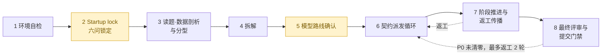
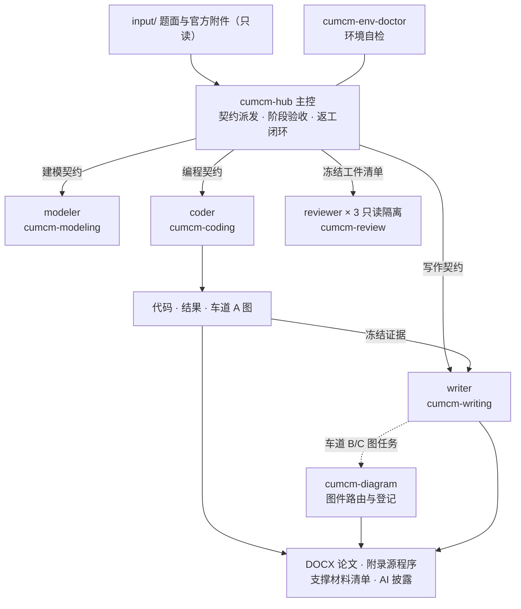

<div align="center">

# CUMCM MathModel Skill

**面向全国大学生数学建模竞赛（CUMCM）的中文端到端 Skill 包**

把 Codex 或 Claude Code 变成有流程、有门禁、有交付的建模队友
<br>八步主流程 · 隔离角色子代理 · 证据冻结 · 三席盲评 · 确定性 DOCX 导出

[](LICENSE)


<p>
  <a href="#快速开始3-步"><strong>快速开始</strong></a> ·
  <a href="#工作原理"><strong>工作原理</strong></a> ·
  <a href="#skill-索引"><strong>Skill 索引</strong></a> ·
  <a href="#手动安装备选"><strong>手动安装</strong></a> ·
  <a href="#faq"><strong>FAQ</strong></a> ·
  <a href="#开发验证"><strong>开发验证</strong></a>
</p>


</div>

---

## 定位

本包可安装到 Codex 或 Claude Code 任一 Coding Agent（下文简称 Agent）。安装到竞赛项目后，
整个建模周期会在一个 Agent 管理的工作区内推进：按八步流程组织建模、编程、写作和评审，
记录关键决策、输入证据与阶段产物，并在提交前检查交付是否完整。最终交付：

- 按推荐版式**确定性导出的 DOCX 论文**（含可编辑公式与嵌入式图表，结构图另附 `.drawio`
  可编辑源文件）；
- **附录源程序**与**支撑材料清单**；
- **AI 使用披露材料**。

> [!IMPORTANT]
> **这是建模辅助工具，不是“全自动出赛论文”工具。**
> 本包负责证据治理与提交前质量检查；核心建模与分析、路线确认、最终图件和提交决定仍由
> 参赛队负责。使用 AI 时必须遵守当届规则并完成相应披露。

## 核心特性

- 🧭 **八步主流程编排** — 从环境自检到提交门禁由 `cumcm-hub` 统一推进，关键决策与未知项
  落盘工作区 `plan.md`，状态在文件而不在对话记忆里。
- 🔒 **Startup lock 六问** — 正式建模前一次性锁定题号、附件、子问题与交付物、最终文件、
  当届规则与路线确认方式；信息不全就停下来问，不猜测。
- 👥 **隔离角色子代理** — modeler / coder / writer / reviewer 只接收任务契约与声明输入，
  不携带主会话历史；reviewer 全程只读。
- 🧑‍⚖️ **三席盲评** — 最终评审冻结同一份工件清单，三个彼此隔离的只读 reviewer 同时评审；
  维度取中位数、P0（阻断提交的最高严重级问题）取并集、席间分差过线交用户裁决。
- 📄 **确定性 DOCX 导出** — python-docx 按推荐版式导出，`[[EQUATION latex="..."]]` 生成
  Word 可编辑公式，内置模板可字节级复现。
- 🔁 **证据冻结与返工传播** — 下游只消费已验收工件；上游证据被替代时，依赖它的代码、
  结果、图表与正文一律重置为待验证，复审通过才重新冻结。
- 🩺 **环境自检分级** — 依赖分为 Tier 0 硬性依赖、Tier 1 按题型安装、Tier 2 可降级三档，
  以 `env_report.md` 报告驱动安装，不静默修改环境。
- 🚦 **合规内建** — 模型路线逐问人工确认，提交前逐项核对当届页数、匿名与格式要求，
  AI 正文标注与披露材料齐全才放行。

## 工作原理

安装后，7 个 Skill 与 4 个角色定义进入你的竞赛项目。hub 按八步主流程推进，图中黄色节点
为人工决策点——信息不全或路线未确认时流程停下等你，不代答：



进入契约派发循环后，hub 把每项工作封装为任务契约（角色、输入、验收标准），派发给对应的
隔离角色子代理；子代理产物落盘工作区，由 hub 验收后才被下游消费：



证据治理贯穿全程：冻结的上游工件发生替代时，受影响的代码、结果、图、表与正文重置为
待验证，完成一致性复审后才重新冻结。最终评审由 hub 汇总三席意见——各维度取中位数、
P0 取并集，席间任一维度分差达到 15 分即标记争议并交用户复核；最终评审最多返工 2 轮，
P0 未清零不得提交。

## Skill 索引

| Skill | 定位 | 职责 |
| --- | --- | --- |
| [`cumcm-hub`](skills/cumcm-hub/SKILL.md) | 主控 | 编排八步流程、任务契约、阶段验收与返工闭环 |
| [`cumcm-env-doctor`](skills/cumcm-env-doctor/SKILL.md) | 环境 | 检查 Python 环境、依赖、系统工具与 Skill 可加载性 |
| [`cumcm-modeling`](skills/cumcm-modeling/SKILL.md) | 建模 | 建立模型假设、符号、推导、验证方案与实现交接 |
| [`cumcm-coding`](skills/cumcm-coding/SKILL.md) | 编程 | 实现模型计算、结果落盘、数据图、运行记录与复现验证 |
| [`cumcm-diagram`](skills/cumcm-diagram/SKILL.md) | 图示 | 路由数据图、精确结构图与概念图并维护图件登记 |
| [`cumcm-writing`](skills/cumcm-writing/SKILL.md) | 写作 | 依据冻结证据撰写中文论文、组织附录与 AI 披露并导出 DOCX |
| [`cumcm-review`](skills/cumcm-review/SKILL.md) | 评审 | 对建模件、代码件和论文件执行分步检查与最终独立评审 |

`cumcm-writing` 支持 `[[EQUATION latex="..."]]` 块级可编辑公式与图表指令，随附可再生成的
[Markdown](skills/cumcm-writing/templates/paper-template.md) /
[DOCX](skills/cumcm-writing/templates/paper-template.docx) 论文模板。

## 快速开始（3 步）

前置条件：

- **Node.js**（含 `npx`）。Python 环境不用提前准备，流程第一步 `$cumcm-env-doctor` 会自检
  并给出安装建议。
- **能启动 Codex 或 Claude Code 之一**。两者都受支持，但整条流程按
  **每个竞赛项目只用一个 Agent** 设计与测试，安装时二者选其一（原因见 [FAQ](#faq)）。
- **一个可运行 bash 的终端**。Linux 或 macOS 终端可直接使用；Windows 用户请在 WSL 或
  Git Bash 中执行，PowerShell/CMD 无法直接运行 `install.sh`。

> [!TIP]
> `$cumcm-hub`、`$cumcm-env-doctor` 这类 `$` 前缀是 `skills` CLI 生态引用已安装 Skill 的
> 约定——“`$` + Skill 名”，用于提示 Agent 加载同名 Skill。它不是环境变量，也不需要在终端
> 执行。Claude Code 用户还可以直接输入 `/cumcm-hub`，通过原生入口调用 hub。

第 2 步必须在竞赛项目根目录执行。下面以新建 `my-contest/` 为例；若项目已经存在，不要执行
`mkdir`，直接进入现有项目根目录后运行安装命令。

```bash
# 1. 克隆本包（任意位置，只需一次）
git clone https://github.com/nature-mine/cumcm-mathmodel-skill.git

# 2. 新建并进入示例竞赛项目（已有项目直接 cd 到其根目录）
mkdir my-contest
cd my-contest
# /path/to 替换为第 1 步克隆目录的实际路径
bash /path/to/cumcm-mathmodel-skill/install.sh claude
```

`install.sh` 会自动完成：安装 7 个 Skill（`--copy`，安装结果不依赖 clone 目录的后续位置）、
部署所选 Agent 的角色定义与 workflow、创建 `input/` 与 `data/`、打印安装清单供人工核对，
并在末尾打印第 3 步要用的启动提示语。

**第 3 步**，分三个动作：

1. 把题面 PDF 与官方附件放进 `input/`（只读；清洗、修复等派生数据只写 `data/`，不得覆盖
   官方文件）。
2. 在竞赛项目根目录**新开**一个所选 Agent 的会话。Skill 与角色清单只在会话启动时加载：
   若安装时已经开着一个会话，那个旧会话看不到新安装的 Skill，先关掉再开；若这是该目录的
   第一个会话，直接开即可。
3. 粘贴 `install.sh` 末尾打印的启动提示语。

启动提示语会加载 `$cumcm-hub`，hub 启动的第一道固定门禁就是探测当前 Agent 的子代理能力。
选 Codex 的用户可以提前自查一步：在终端运行 `codex features list`，在输出中找到
`multi_agent` 一行，确认其状态为 `stable true`（表示多代理功能可用）；不确定也没关系，hub
启动时会再探测一遍。不使用脚本时的手动安装步骤见[手动安装（备选）](#手动安装备选)。

### 让 Agent 帮你安装

不想手动敲命令，可以让 Agent 替你完成整个安装：在竞赛项目根目录打开 Codex 或 Claude Code
会话，发给它下面这段话（仓库地址按实际来源替换；`claude` 按所选 Agent 换成 `codex`）：

> 请先把 `https://github.com/nature-mine/cumcm-mathmodel-skill` 克隆到当前目录之外，再读取
> 克隆目录中的 `AGENT_INSTALL.md`，按其中步骤把这个 Skill 包安装到当前目录，Agent 参数选
> `claude`。

[`AGENT_INSTALL.md`](AGENT_INSTALL.md) 是专门写给 Agent 读的安装说明，包含精确步骤、验收
标准与边界约定（不修改包内容、不提前启动建模流程）。安装完成后 Agent 会把启动提示语转述
给你；第 3 步的三个动作（放题面、**新开会话**、粘贴提示语）仍需你自己完成。

### 接下来会发生什么

第一步是环境自检：`$cumcm-env-doctor` 生成 `env_report.md` 与 `env_report.json`，Python
依赖缺什么、怎么装，以报告为准。

第二步，hub 发起 startup lock 六问（startup lock 即“启动锁定”）：正式建模开始前，把六个
关键问题一次性列给你——竞赛与题号、输入附件、子问题与显式交付物、最终文件、当届及赛区
规则、模型路线确认方式——答案写入 `plan.md` 后才继续；信息不全就停下等你补齐，不猜测。
为了把问题问得具体，hub 提问前会先浏览一遍 `input/` 里的题面与附件；正式的深入读题与数据
剖析在锁定之后的“读题、数据剖析与分型”阶段才进行。

模型路线确认是人工决策点：每个子问题给出候选路线并等你确认，不会代选。唯一例外是你在
startup lock 第 6 问中明确选择“全权委托”——即显式授权 Agent 代选模型路线；该授权会记入
`plan.md`，且不取消后续评审门禁。

完整流程依次为：环境自检 → startup lock → 读题、数据剖析与分型 → 拆解 → 模型路线确认 →
契约派发循环 → 阶段推进与返工传播 → 最终评审与提交门禁（见[工作原理](#工作原理)）。

## 手动安装（备选）

`install.sh` 内部即以下步骤；需要自定义时可手动执行（同样在 bash 环境中）。其中
`npx skills` 是开放的 [vercel-labs/skills](https://github.com/vercel-labs/skills) CLI，
负责把 Skill 安装到所选 Agent 的项目级 Skill 目录。将 `CUMCM_SKILL_PACK` 改为本包的
绝对路径，先确认 Skills CLI 能发现全部 Skill：

```bash
CUMCM_SKILL_PACK=/absolute/path/to/cumcm-mathmodel-skill
npx skills add "$CUMCM_SKILL_PACK" --list
```

方案 A：使用 Codex。在目标竞赛项目根执行：

```bash
npx skills add "$CUMCM_SKILL_PACK" \
  --agent codex \
  --skill '*' \
  --yes \
  --copy
mkdir -p .codex/agents
cp "$CUMCM_SKILL_PACK"/codex/agents/*.toml .codex/agents/
npx skills list --agent codex --json
codex features list
```

方案 B：使用 Claude Code。在目标竞赛项目根执行：

```bash
npx skills add "$CUMCM_SKILL_PACK" \
  --agent claude-code \
  --skill '*' \
  --yes \
  --copy
mkdir -p .claude/agents .claude/workflows
cp "$CUMCM_SKILL_PACK"/claude/agents/*.md .claude/agents/
cp "$CUMCM_SKILL_PACK"/claude/workflows/cumcm-contest.md .claude/workflows/
npx skills list --agent claude-code --json
```

随后创建 `input/` 与 `data/`，把题面与附件放入 `input/`，并在新开的 Agent 会话中发送对应
启动提示语。

Codex 启动提示语：

> 加载 `$cumcm-hub`，以当前目录作为竞赛工作区，按八步主流程执行。启动时先探测并记录 Codex 的 subagent 能力，然后调用 `$cumcm-env-doctor` 做环境自检并进行 startup lock 六问；任何信息缺失按 `stop_and_report` 停下，不得猜测。
> 能力可用时按 `.codex/agents/*.toml` 使用隔离角色派发，最终三席 reviewer 同时执行；若宿主有能力但角色、功能开关、只读门禁或并发条件未就绪，必须 `blocked`，不得顺序降级。

Claude Code 启动提示语：

> 加载 `$cumcm-hub`，以当前目录作为竞赛工作区，按 `.claude/workflows/cumcm-contest.md` 执行。先做环境自检和 startup lock；任何信息缺失按 stop-and-report 停下。

两条提示语都会加载 hub；Agent 子代理能力探测是 hub 的固定启动门禁。提示语原文中的“宿主”
即本文的 Agent，是包内运行协议的用词。Claude Code 版保持 workflow 中的标准入口，由
workflow 与 hub 展开能力探测细节。

## Agent 部署与分派规则

本节说明部署边界与子代理分派机制，供排查安装问题或想了解运行原理时参考；日常参赛按
快速开始操作即可。包内 `skills/` 各 SKILL.md 属于运行协议，其中把承载 Skill 的 Agent
称为“宿主”（host），与本文的“Agent”同义。

### 安装边界

`skills add` 只安装 `skills/` 下的 7 个 Skill，复制到所选 Agent 的项目级 Skill 目录：
Codex 为 `.agents/skills/`，Claude Code 为 `.claude/skills/`。角色定义是另一组文件、放在
另一个目录，`skills add` 不会代劳：Codex 的四个 custom agent TOML 需复制到
`.codex/agents/`；Claude Code 的四个 subagent 定义与八步 workflow 需复制到
`.claude/agents/` 与 `.claude/workflows/`（`install.sh` 已代为完成）。各 Skill 的
`agents/openai.yaml` 只是展示与调用元数据，不是角色定义。`--copy` 使安装结果不依赖源
checkout 的后续位置。

安装后须新开 Agent 会话，使 Skill 与角色清单重新加载；Codex 不使用 `claude/`，
Claude Code 不使用 `codex/`。

### 子代理能力门禁

支持干净或最小上下文派发时，必须使用真正的 modeler、coder、writer、reviewer 子代理。
Codex 当前工具支持时使用 `fork_turns="none"`（派发子代理时不携带父会话历史）或等价选项，
只发送任务契约与声明输入。reviewer 必须只读：Codex 定义采用只读沙箱、禁止审批和
Web Search；Claude Code reviewer 只开放 `Read/Grep/Glob`。

最终评审先冻结同一份 artifact manifest（本轮评审对象的工件清单，保证三席看到完全相同的
输入），再同时启动三个彼此隔离的只读 reviewer thread。三席只返回消息，hub 等全部结束后
才写报告与汇总，避免共享工作区泄漏先返回席位的意见。

只有确认 Agent 版本本身不提供 subagent 功能时，才允许顺序兜底。所有评审必须标注
`self-review, 独立性受限`，汇总写 `fallback_reason: subagent_unavailable`，且不得把 A/B/C
顺序复评称作三席盲评。Agent 有该能力但角色未部署、功能被配置禁用、限权未生效或并发不足时
必须 `blocked`，不得降级——`blocked` 是流程状态标记，含义是停下并报告缺什么，修复后重试。

Codex custom agent 机制依据当前
[Codex Subagents 官方文档](https://learn.chatgpt.com/docs/agent-configuration/subagents)。

### 安装后自检

`npx skills list --agent <codex|claude-code> --json` 应返回 7 个项目级 Skill；看到 Skill 索引
中的 7 个名称即表示安装成功。角色文件缺失、能力被禁用或限权未生效不属于“无子代理环境”，
必须修复后重试。发送启动提示语后，hub 会调用已安装的 `cumcm-env-doctor/scripts/check_env.py`，
用户无需手动拼装脚本路径。env-doctor 把依赖分为三档：Tier 0 硬性依赖、Tier 1 按题型安装、
Tier 2 可降级的系统工具；只有报告中的 Skill 包检查和 Tier 0 全部为 `OK` 才进入 startup
lock，Tier 1/2 缺项按报告安装或降级，不代表安装失败。

## FAQ

<details>
<summary><b>为什么每个竞赛项目只能选一个 Agent，不能两个都装？</b></summary>
<br>

不在同一项目混装两套角色定义，也不建议中途换 Agent——这不是能力限制，而是双套并存
未经测试，容易互相干扰。整条流程按单 Agent 设计与验证，Codex 不使用 `claude/`，
Claude Code 不使用 `codex/`。

</details>

<details>
<summary><b>安装成功了，但新会话里 Agent 不认识 <code>$cumcm-hub</code>？</b></summary>
<br>

Skill 与角色清单只在会话启动时加载，安装前已开的会话看不到新 Skill——先关掉再新开一个。
仍不生效时，用 `npx skills list --agent <codex|claude-code> --json` 确认 7 个 `cumcm-*`
Skill 都在项目级列表里，详见[安装后自检](#安装后自检)。

</details>

<details>
<summary><b>env-doctor 报了缺项，是不是安装失败了？</b></summary>
<br>

不一定。只有 Skill 包检查和 Tier 0 硬性依赖必须全部 `OK`；Tier 1 按题型安装、Tier 2 可
降级，按 `env_report.md` 的建议处理即可，缺项不代表安装失败。

</details>

<details>
<summary><b>我的 Agent 版本没有子代理功能，还能用吗？</b></summary>
<br>

能，但独立性受限：只有确认 Agent 本身不提供 subagent 功能时才允许顺序兜底，评审会标注
`self-review, 独立性受限`，不冒充三席盲评。若 Agent 有该能力只是配置未就绪，流程会
`blocked` 并告诉你缺什么，修复后重试，详见[子代理能力门禁](#子代理能力门禁)。

</details>

<details>
<summary><b>它会替我选模型路线、替我决定交卷吗？</b></summary>
<br>

不会。模型路线逐子问题人工确认（除非你在 startup lock 中显式选择“全权委托”，且该授权
不取消评审门禁）；提交决定始终由参赛队做出，包只负责把提交前核对项逐一摆在你面前，
详见[接下来会发生什么](#接下来会发生什么)。

</details>

<details>
<summary><b>Windows 能用吗？</b></summary>
<br>

能。`install.sh` 与手动安装命令请在 WSL 或 Git Bash 中执行；PowerShell/CMD 无法直接
运行 bash 脚本。

</details>

## 开发验证

本节面向包维护者；参赛使用者无需执行。

```bash
uv run pytest -q
uv run python scripts/validate_pack.py
uv run ruff check
```

`tests/` 与包顶层 `scripts/` 是包质量工具链，不随 `skills add` 安装；`skills/*/scripts/` 是
对应 Skill 的运行时资产，会随 Skill 安装。

<details>
<summary><b>重建内置 DOCX 模板</b></summary>
<br>

需要重建内置 DOCX 模板（`skills/cumcm-writing/templates/paper-template.docx`）时，在包根执行：

```bash
TEMPLATE_WORKSPACE="$(mktemp -d)"
mkdir -p "$TEMPLATE_WORKSPACE"/{paper,input,data,code,support}
cp skills/cumcm-writing/templates/paper-template.md "$TEMPLATE_WORKSPACE/paper/paper.md"
uv run python skills/cumcm-writing/scripts/docx_export.py \
  --workspace "$TEMPLATE_WORKSPACE" \
  --source paper/paper.md \
  --output paper/paper-template.docx
cp "$TEMPLATE_WORKSPACE/paper/paper-template.docx" \
  skills/cumcm-writing/templates/paper-template.docx
```

模板在一个一次性临时工作区中生成，里面只放模板 Markdown（`paper/paper.md`）。导出器除
DOCX 外还会在该工作区生成 `support_manifest.json`（支撑材料清单，正常导出论文时的随附
产物）；重建模板只需把 `paper-template.docx` 拷回包内，清单等副产物留在临时目录即可，
不会写入模板目录。

`tests/test_paper_template.py` 会按相同 fixture 布局重新生成，并与仓库内 DOCX 做字节级比较。

</details>

## 许可证与致谢

本包以 [MIT License](LICENSE) 发布。部分脚本与参考文件改编自以下开源项目，完整的上游
版权、参考路径与修改说明见 [THIRD_PARTY_NOTICES.md](THIRD_PARTY_NOTICES.md)：

- **scipilot-figure-skill**（MIT）— 数据剖析脚本与证据图规则；
- **My-MathModeling-skills**（MIT）— 获奖论文风格画像、评审标准与摘要结构参考；
- **nature-skills**（Apache-2.0）— 概念图提示词脚本；
- **chinese-thesis-workbench-skill**（MIT）— DOCX 导出器、文风与版式治理参考。

Skill 安装由 [vercel-labs/skills](https://github.com/vercel-labs/skills) CLI 驱动；DOCX
导出基于 python-docx 与 latex2mathml。

---

<div align="center">

以 CUMCM 当届官方规则为最终依据，本包的门禁只帮你不漏项，不替你担保合规。

[⬆ 回到顶部](#cumcm-mathmodel-skill)

</div>
